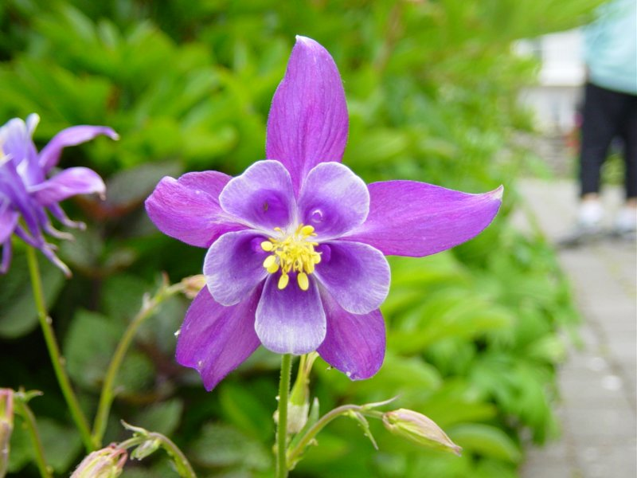

# Image Filtering using OpenCL

This is the implementation of 4 image filters, including Box Filter, Gaussian Filter, Laplacian Filter and Sharpenning Filter using OpenCL on GPU.
I also implemented these filters using C++ and OpenCV to measure the speed up taht can be achieved using GPU over CPU.
The follwing table show the results. It can be seen from the results that on average we can get 3.3 faster processing on GPU.
The experiments have been done on GTX970.

| Filtering Method  |  Speed on CPU (ms) | Speen on GPU (ms) | Image Resolution |
| :---:             | :---: | :---: | :---: |
| Box Filter        | 3.26 | 0.93 | 800*600 |
| Gaussian Filter   | 3.17 | 0.95 | 800*600 |
| Laplacian Filter  | 3.55 | 0.92 | 800*600 |
| Sharpening Filter | 3.18 | 0.92 | 800*600 |

These are example of the input image and resulted image after filtering.

  

  

